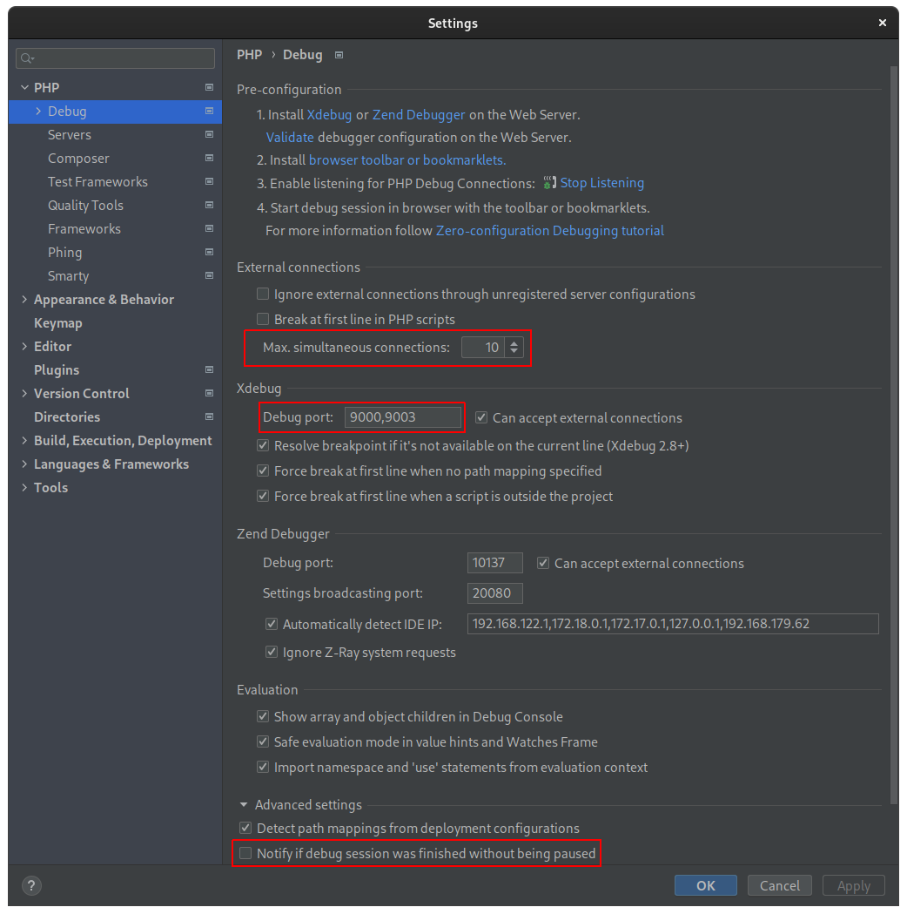
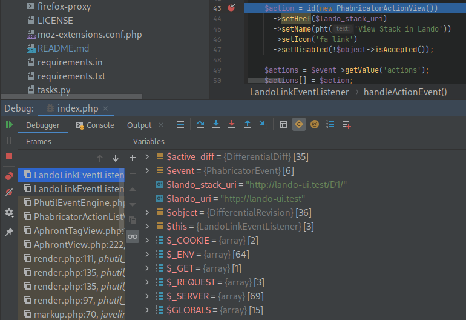

# Mozilla Phabricator

## Prerequisites

 * `docker`
 * `docker-compose`
 * Firefox, or some other way to connect your browser to a SOCKS proxy.

## Installation

 1. Pull the repository into a separate (e.g. `phabricator`) directory.
 1. For Phabricator only, from within the `phabricator` directory run `docker-compose up --build`.

## Accessing the websites provided by the demo

### Firefox configuration

You can either configure the existing Firefox to use our proxy, or run a
preconfigured Firefox.

**To configure your current browser**:

1. Open `Preferences -> Net Proxy -> Settings`
1. Choose the `Manual Proxy Configuration` radio button
1. Set the `Proxy HTTP Server` to `localhost`, and the `Port` to `1090`.

**To run Firefox with an empty profile**:

1. Please set the environment variable `FIREFOX_CMD` to `/path/to/firefox` if
   your system does not recognize the `firefox` command.
1. In a new terminal, run `firefox-proxy`, or
   `firefox-proxy $(docker-machine ip)` if you are using `docker-machine`.
1. A new browser with an empty profile will open.

### Websites provided by the demo

 * Phabricator - http://phabricator.test

## Preconfigured users:

For performing administration tasks in Phabricator, first log out of
Phabricator and then go to the login page with the `Login using BMO` button
and add `?admin=1` to the URL. You can also navigate directly to
http://phabricator.test/auth/login/password:self/

`user:admin`, `password:password123456789!`

## PHP Development:

Install Python dependencies:

`$ pip install -r requirements.txt`

After adding, renaming, or moving classes, run `arc liberate` to rebuild the
class map:

`$ invoke liberate`

To test changes in code:

`$ invoke test`

### Attaching your debugger

Our development container is outfitted with Xdebug, but you have to do some
local setup to take advantage of it. Note that the following directions use
PHPStorm as the example IDE, though any Xdebug-compatible app should work.

1. Start the development environment from the `suite` repository.
1. Configure your IDE/debugger's Xdebug settings:
    1. Port 9000 should be included in the list of XDebug ports.
    1. It should accept at least 10 simultaneous connections
    1. Uncheck the "Notify if debug session was finished without being paused" option so that PhpStorm doesn't
       continually pop up a notification if web requests succeed without hitting a breakpoint. This allows background
       requests (fetching resources, `bmo.feed` requests, etc) to function without triggering warnings.
    
1. Configure your source mappings from your host's directories to your server's (docker container's) directories
    1. It's recommended to have the `arcanist` and `phabricator` source code in your PHP's includes
    so that you can step into (debug) and Intellisense the vendor code 
       * This can be set up by cloning [phabricator](https://github.com/phacility/phabricator) and
         [arcanist](https://github.com/phacility/arcanist), then checking out the appropriate commits as defined in
         this repository's `Dockerfile`.
    1. Create a new "server" configuration with the host as `phabricator.test` and the path mappings as shown below: 
1. Test your mappings
    1. Enable the debugger in PhpStorm 
    1. Set a breakpoint in `LandoLinkEventListener`
    1. Go to [`phabricator.test/D1`](http://phabricator.test/D1)
    1. Your IDE should have stopped the control flow on your breakpoint and be showing you debugger details 


##### My pages are no longer loading after enabling debugging!?

Due to the `phd` daemon, there's four PHP processes that will attach to your debugger, but mostly sit in the
background and be pretty quiet. If you don't bump your "Max. simultaneous connections" in your IDE, you'll find that
the daemon processes hog these connections while Phabricator page loads will wait for one of these connections to become
free (which won't, since the daemon processes won't stop unless Phabricator is turned off).

TL;DR: increase your "Max. simultaneous connections" to at least 10 (4 for the daemons, plus 6 as a buffer for all the
concurrent http requests).

### Useful debugging commands
```
docker-compose -f docker-compose.yml -f docker-compose.bmo.yml exec phabricator vi <filename>

docker-compose -f docker-compose.yml -f docker-compose.bmo.yml exec phabricator /app/phabricator/bin/differential extract <commit-sha>

docker-compose -f docker-compose.yml -f docker-compose.bmo.yml exec phabdb mysql --user=root --password=password
```

## Support

To talk to the Mozilla `phabricator` developers, you can join them on [Matrix](https://chat.mozilla.org/#/room/#conduit:mozilla.org).

